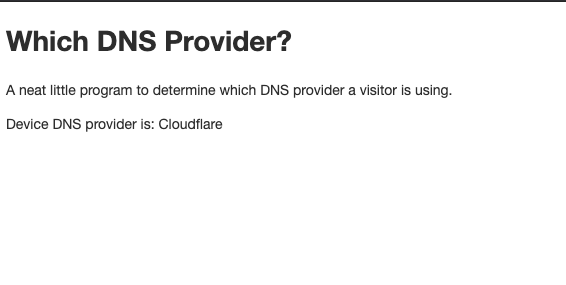

# DNS observer

A little demo project to detect which DNS provider a visitor is using.

**Screenshot**:

## Setup

You'll need a remote server setup.

Setup DNS records, an NS and A records (sorry, I didn't setup the use of IPv6 at this time).

First an A record for the server where the DNS and HTTP server will be run.

Next setup an NS record that for subdomain 'dns-observer' that points to 
the name defined in the A record.

Clone this repository and run it.

## Included

There are files which contain the IPv4 ranges of Cloudflare and NextDNS.

Cloudflare's ranges can be found [here](https://www.cloudflare.com/ips/).

I took the IP ranges for NextDNS from [ipinfo.io](https://ipinfo.io/AS34939) 
but the ranges aren't where the requests to the DNS server will come from.

## Acknowledgments

This project was just quickly slapped together for a proof of concept but 
it wouldn't have been possible without the following:

 * [miekg's DNS](https://github.com/miekg/dns)
 * [spf13's viper](https://github.com/spf13/viper)
 * [Google's uuid](https://github.com/google/uuid)
*Note: This is not associated nor an official Google project. Or any of the above mentioned for that matter.*